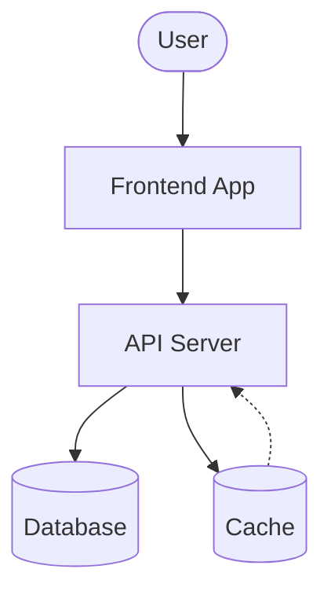
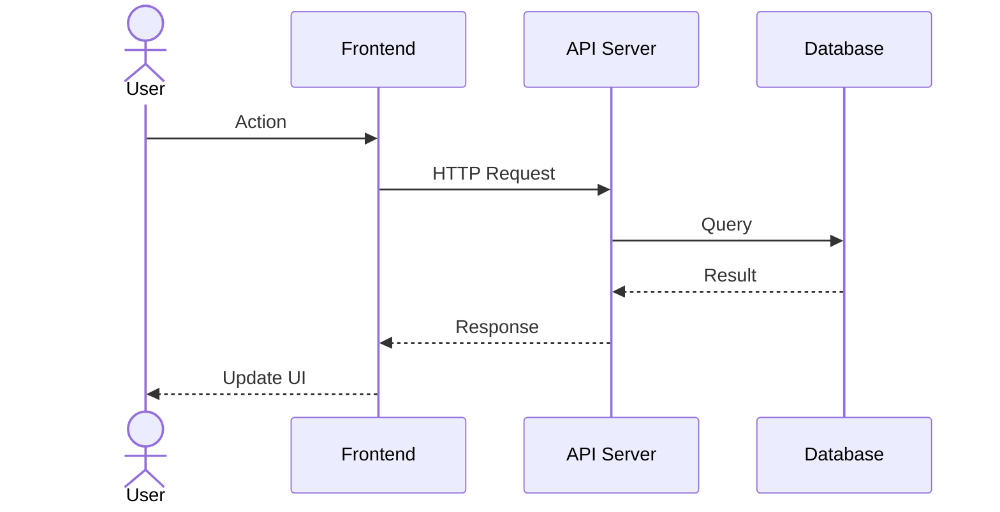

# Architecture Overview

## System Flow

## Request Lifecycle

## Key Decisions

| Decision | Choice | Rationale |
|----------|--------|-----------|
| Database | PostgreSQL | Reliability, JSON support |
| Cache | Redis | Speed, pub/sub |
| API Style | REST | Simplicity, tooling |
