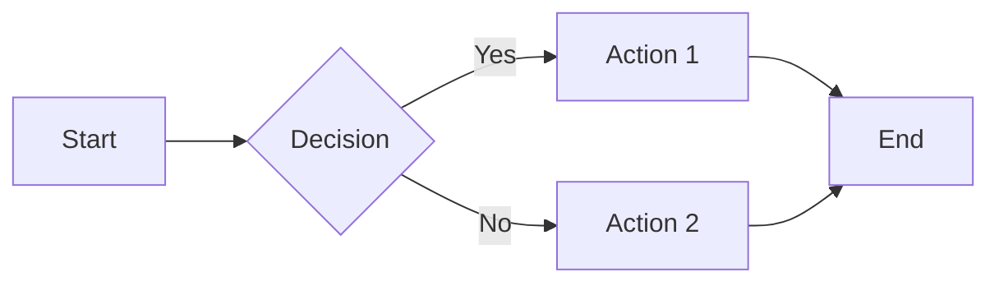
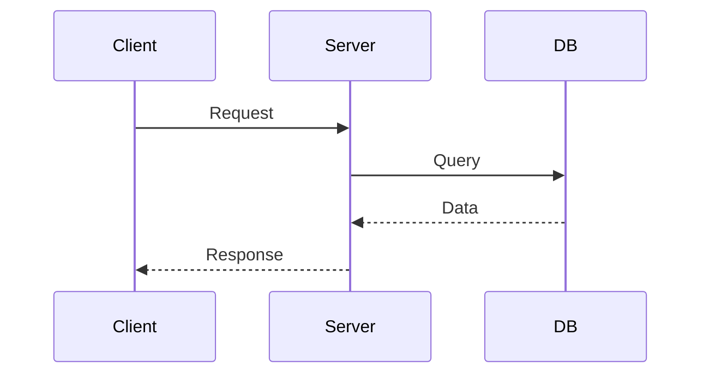
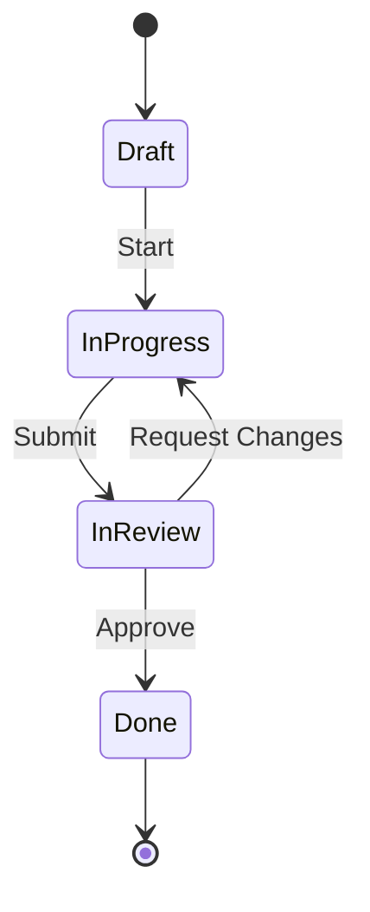
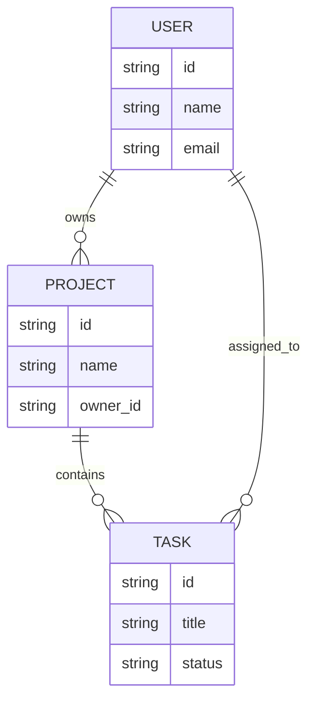
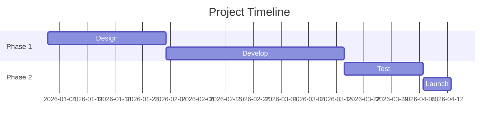

# Mermaid Diagram Examples

This page demonstrates all major Mermaid diagram types. These render interactively in the browser.

## Flowchart

## Sequence Diagram

## State Diagram

## Entity Relationship

## Gantt Chart

